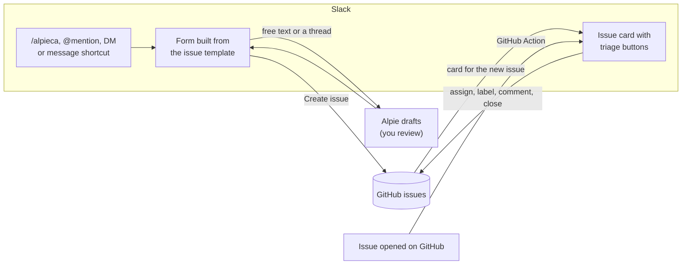

# Alpieca 🦙

**Slack ↔ GitHub, the woolly way.** Alpieca is the Slack app [169Pi](https://github.com/169Pi) uses to turn conversations into well-formed GitHub issues. People describe a bug or an idea in Slack, or point at a thread. [Alpie](https://huggingface.co/169Pi/Alpie-Core) drafts the issue from the repo's own issue templates, a human reviews it, and the issue lands in GitHub. Issues opened directly on GitHub show up in Slack too, with buttons to triage them.

It's built to be forked. Everything specific to us (the repo, the templates, the command name) is configuration, so you can run the same setup for your own project and Slack workspace.

## What it does

- **Forms built from your issue templates.** `/alpieca` reads `.github/ISSUE_TEMPLATE/*.md` straight from GitHub and turns each template into a Slack form. Edit a template and the form updates within minutes, no redeploy.
- **Drafting with Alpie.** Describe the problem in your own words, @mention Alpieca in a thread, or use *Turn into GitHub issue* on any message. Alpie fills in the template from what was actually said, adds useful context for maintainers, and you review everything before it's filed.
- **Ask it things.** DM Alpieca or @mention it with a question ("are there any merch ideas filed already?"). Alpie answers from the templates and recent issues.
- **Issue cards with triage buttons.** Every new issue, whether filed from Slack or opened on GitHub, appears in Slack as a card with **Assign to me**, **Label**, **Comment** and **Close/Reopen**.
- **Credit for the reporter.** Issues @mention the reporter's GitHub account, not just the bot's.



## Using it

| In Slack | What happens |
| --- | --- |
| `/alpieca` | Pick a template, then fill in the form generated from it. |
| `/alpieca merch` | Jump straight to a template by name. |
| `/alpieca <describe the issue>` | Alpie picks the template and drafts the issue for you to review. |
| **More actions → Turn into GitHub issue** on a message | Alpie drafts an issue from that message and its whole thread. |
| `@Alpieca` in a channel or thread, or a DM | Something to raise gets a private *Review Alpie's draft* button; a question gets an answer in the thread. A bare `@Alpieca` in a thread means "turn this thread into an issue". |
| `/alpieca github <username>` | Link your GitHub account (you're also asked the first time you file). |
| `/alpieca help` | Lists the templates and these options. |

After an issue is created, Alpieca posts its **card** where you raised it: the channel, the thread, or your DM. It also posts to a team channel if you've configured one.

### Issue cards and triage

Cards show the title, state, labels, reporter and a short preview, plus **View on GitHub**, **🙋 Assign to me**, **🏷️ Label**, **💬 Comment** and **✅ Close** (or **↩️ Reopen**). Each action happens on GitHub, then the card refreshes from GitHub with a note such as *Closed by @Rahul*. Comments are posted with the commenter's name and GitHub username, and are quoted in the card's thread.

Issues opened directly on GitHub are posted as the same card by the [`alpieca-new-issue`](../.github/workflows/alpieca-new-issue.yml) workflow. Issues filed from Slack carry a hidden `<!-- alpieca -->` marker, so they're never posted twice.

## How templates become forms

Alpieca works with GitHub's Markdown issue templates as they are. No extra configuration is needed.

| In the template | In Slack |
| --- | --- |
| `title: "[Project]: <…>"` | A **Title** field. The issue is titled `[Project]: <what you typed>`. |
| `### Heading` followed by `*italic guidance*` | A multi-line box, with the guidance shown as a hint. |
| `* **Field:**` bullets under a heading | One single-line input per bullet. |
| `(Optional)` or `(if applicable)` in a heading or bullet | An optional input. Everything else is required. |
| A bullet named like *Repo*, *Link*, *Demo*, *Docs* or *URL* | Must contain an `https://` link. |
| A bullet named like *Author*, *Owner* or *Mastermind* | Pre-filled with the reporter's Slack name. |
| `labels:` and `assignees:` | Applied to the issue. If GitHub drops a label, the card says so. |

The issue is written back in the template's exact layout (same headings, bullets and prefix), so it looks the same as one opened from GitHub's **New issue** page. Unanswered optional fields read `_No response_`.

## Drafting with Alpie

Alpie is optional. Without an API key, Alpieca still works, with plain forms.

With a key, Alpie gets the template's fields and the feedback (free text or a Slack thread). It picks a template if none was chosen, fills in what the feedback supports, and adds an **Additional context** section: who else was involved, constraints that were mentioned, and open questions for a maintainer. **Nothing is filed until a person reviews the draft and clicks *Create issue*.**

The bot doesn't take Alpie's output on trust:

- **Fields:** only fields the template defines are kept. Slack's length limits are enforced, and title prefixes are handled by the bot, not the model.
- **Links:** any link that wasn't in the original conversation is removed, so made-up URLs never reach GitHub. Answers can only link to real issues, the repo, or the conversation.
- **Instructions inside messages:** Slack content is passed to Alpie as data, so instructions written in a message are ignored.
- **Invented reasons:** the prompt tells Alpie not to make up reasons or pitches that nobody gave.
- **Failures:** if Alpie fails or times out, the reporter falls back to the normal form, and their original text is kept.

**Speed.** Alpie is a reasoning model, so a draft or answer takes about 10–20 seconds. Alpieca hides most of that wait in two ways:
- **Drafting ahead:** when an @mention or DM sounds like something to raise, drafting starts immediately, before anyone clicks.
- **Live loading animation:** Alpie's output is streamed, so the form and the answer message show the current stage, a 🦙 moving along a progress track, and elapsed seconds. Answers fill in as they're written.

**Other models.** The Alpie client speaks the OpenAI-style `/chat/completions` API, with optional streaming. Point `ALPIE_BASE_URL` and `ALPIE_MODEL` at another compatible endpoint if you prefer. It handles reasoning models that think out loud before `</think>`, as well as models that don't.

## Access and privacy

Issues land in a **public** repo under the bot's GitHub token, so access is deliberately narrow:

- **Workspace members only.** People from other organizations (for example in Slack Connect channels) can't file issues, use Alpie, or press triage buttons. Messages from them are ignored.
- **Triage buttons are for full members.** Guests can raise issues but can't assign, label, comment on or close them. Set `SLACK_TRIAGE_USERS` to limit triage to specific people.
- **Private conversations stay private.** An issue drafted from a public channel links back to its source thread. Issues drafted from private channels and DMs don't include a link.
- **Reporters see a warning.** Before filing a draft, the form reminds them the repo is public and that their name and GitHub username will appear on the issue.
- **Content from GitHub is escaped.** Issue titles and bodies can't ping `@channel` or fake links in Slack.

## Fork it for your team

1. **Copy `slack-bot/`, the workflow, and your issue templates** into your repo. Alpieca reads whatever is in `.github/ISSUE_TEMPLATE/`.
2. **Edit [`manifest.yml`](manifest.yml):** change the app name, descriptions, slash command and repo mentions. If you change the command, set `SLACK_COMMAND` to match.
3. **Create the Slack app** from the manifest (below).
4. **Set `GITHUB_REPO`** to your `owner/repo`, and decide whether you want Alpie (or another compatible model) for drafting.
5. **Run it** wherever you can keep one small process running (below).

## Setup

### 1. Slack app
At [api.slack.com/apps](https://api.slack.com/apps), choose **Create New App → From an app manifest**, paste [`manifest.yml`](manifest.yml), and install it to your workspace.
- **Bot token:** *OAuth & Permissions → Bot User OAuth Token* (`xoxb-…`) → `SLACK_BOT_TOKEN`
- **App token:** *Basic Information → App-Level Tokens* → generate one with `connections:write` (`xapp-…`) → `SLACK_APP_TOKEN`

Whenever the manifest's scopes or events change, paste it again and **Reinstall to Workspace**. Invite the bot to channels where you'll use it on threads (`/invite @Alpieca`).

### 2. GitHub token
Create a [fine-grained personal access token](https://github.com/settings/personal-access-tokens/new), or a GitHub App installation token, limited to your repo:
- **Issues:** Read and write
- **Contents:** Read-only

Issues are opened as the token's owner, so a dedicated bot account keeps things tidy. If the repo belongs to an organization, an org owner may need to approve the token. Until they do, it can read but not write.

### 3. Alpie (optional)
Create a key at [playground.169pi.ai](https://playground.169pi.ai/dashboard/api-keys) → `ALPIE_API_KEY`.

### 4. Run it locally
```bash
cp .env.example .env    # fill in the tokens
npm install
npm run dev
```
You should see `Alpieca running (Socket Mode), filing into <owner/repo>`. Try `/alpieca help` in Slack.

### 5. Post GitHub-opened issues to Slack (optional)
In your repo's **Settings → Secrets and variables → Actions**, add:
- **Secret `SLACK_BOT_TOKEN`:** the bot's `xoxb-…` token, so button clicks reach the running bot.
- **Variable `SLACK_ISSUES_CHANNEL`:** the channel's **ID** (`C…`, from the channel's *About* tab), not its name.

Invite the bot to that channel. Set the bot's `SLACK_NOTIFY_CHANNEL` to the same ID so issues from Slack and from GitHub land in one place.

## Configuration

| Variable | Required | What it does |
| --- | --- | --- |
| `SLACK_BOT_TOKEN` | yes | Bot token (`xoxb-…`). |
| `SLACK_APP_TOKEN` | for Socket Mode | App-level token (`xapp-…`) with `connections:write`. |
| `SLACK_SIGNING_SECRET`, `PORT` | for HTTP mode | Use instead of `SLACK_APP_TOKEN` to receive events over HTTP at `/slack/events`. |
| `GITHUB_TOKEN` | yes | Fine-grained token with Issues read/write and Contents read. |
| `GITHUB_REPO` | | `owner/repo` to file into. Defaults to `169Pi/devrel`. |
| `GITHUB_TEMPLATE_REF` | | Branch to read templates from. Defaults to the default branch. |
| `ALPIE_API_KEY` | | Turns on drafting and answers. |
| `ALPIE_BASE_URL`, `ALPIE_MODEL`, `ALPIE_TIMEOUT_SECONDS` | | Defaults: `https://api.169pi.com/v1`, `alpie-32b`, `90`. |
| `SLACK_COMMAND` | | Defaults to `/alpieca`. Must match the manifest. |
| `SLACK_NOTIFY_CHANNEL` | | Channel ID that also gets every new issue card. |
| `SLACK_TRIAGE_USERS` | | Comma-separated Slack user IDs allowed to triage. Defaults to all full members. |
| `DATA_DIR` | | Where Slack-to-GitHub username links are stored. Defaults to `~/.alpieca`. Keep it on persistent storage. |
| `TEMPLATE_DIR`, `TEMPLATE_CACHE_SECONDS` | | Read templates from disk instead of GitHub, and how long to cache them. Defaults: GitHub, 300 s. |

## Hosting

Alpieca is one small Node.js process (about 100 MB of RAM). In Socket Mode it only makes **outbound** connections, so it needs **no public URL, inbound ports or load balancer**. Any always-on machine works: a small VM or VPS, a container platform, or a server you already have. Three things matter wherever you run it:

- **Exactly one instance.** Two copies would split Slack's events between them.
- **Persistent `DATA_DIR`.** It holds the Slack-to-GitHub username links.
- **Secrets as environment variables.** Inject them from your platform's secret store, or from a file only the service can read. Never bake them into an image.

**Docker:**
```bash
docker build -t alpieca .
docker run -d --name alpieca --restart unless-stopped --env-file .env -v alpieca-data:/data alpieca
```

**systemd on a Linux server:** see [`deploy/alpieca.service`](deploy/alpieca.service). The setup steps are in its header comment, and secrets go in `/etc/alpieca.env` with mode `600`. View logs with `journalctl -u alpieca -f`. To update, run `git pull && npm ci --omit=dev`, then `systemctl restart alpieca`.

## Development

```bash
npm test
```

The tests parse the real templates in `../.github/ISSUE_TEMPLATE`. They cover:
- rendering issues back into each template's layout
- Slack Block Kit limits
- Alpie reply parsing and link filtering, using a fake streaming API
- intent detection, the loading animation, and access rules
- the GitHub workflow script, run against a fake Slack API

| Path | What's in it |
| --- | --- |
| `src/app.js` | Slack handlers: commands, shortcuts, mentions, DMs, forms and triage buttons. |
| `src/templates.js` | Parses issue templates, validates answers, and renders issues. |
| `src/modal.js` | Slack forms. |
| `src/issue-card.js` | Issue cards. Has no dependencies, because the GitHub workflow uses it too. |
| `src/alpie.js` | The Alpie client: drafting, answers, streaming, and output checks. |
| `src/progress.js` | The loading animation. |
| `src/access.js` | Who may use the bot, and which channels are public. |
| `src/people.js` | Stored Slack-to-GitHub username links. |
| `src/github.js` | GitHub API calls. |
| `scripts/post-github-issue.js` | Run by the workflow to post GitHub-opened issues to Slack. |
